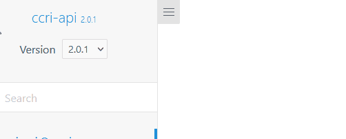

# Docsify Versioned Plugin

The Docsify Versioned Plugin allows you to manage and display multiple versions of your documentation using a simple dropdown selector. Users can easily switch between different versions of the documentation, while the plugin ensures that the content and links are updated accordingly.

  



## Installation

1. Add the following script tag to your `index.html` file, preferably after the Docsify script:

```html
<script src="https://cdn.jsdelivr.net/npm/docsify-versioned-plugin@0.0.1/index.js"></script>
```

2. Add the following style tag to your index.html file to include the plugin's CSS:

```html
<link rel="stylesheet" href="https://cdn.jsdelivr.net/npm/docsify-versioned-plugin@0.0.1/styles.css">
```

## Configuration

In your index.html file, update the Docsify configuration to include the versions and default version:

```js
window.$docsify = {
  // ... Other configuration options
  versions: [
    { folder: 'v2', label: 'v2.0.0', default: true },
    { folder: 'v1', label: 'v1.0.0', default: false }
  ],
  versionSelectorLabel: 'Version',
};
```
Update the `versions` array with your version names and folders. Set the `default` property to `true` for the version you want to display by default. The order of the array also defines the order in the dropdown.

Make sure the respective folder exists. Labels can be updated without the need to change the folder name.

You can also update the `versionSelectorLabel`, if you want to change the label in front of the dropdown.

## Usage

Once the plugin is installed and configured, it will automatically display a dropdown selector at the top of the navigation bar, allowing users to switch between different versions of the documentation. The content and links will be updated accordingly based on the selected version.

In your Markdown files, you can use the `{{versionLabel}}` placeholder to display the current version label. For example, you can include the following line in your _coverpage.md file:

```
# My Project Documentation ({{versionLabel}})
```
This will display the current version label (e.g., "v1.0.0" or "v2.0.0") next to the project title on the cover page.

## Troubleshooting

### Search Plugin
If you want to use the search plugin and have the search limited to the current version, you can paste the following code in your `index.html` and create a separate name space for each version.

```html
<script>
    (function() {
      // Get the current version from the URL
      const versionFolder = window.location.pathname.split('/')[1];
  
      // Set the search configuration based on the current version
      window.$docsify.search = {
        maxAge: 86400000,
        paths: 'auto',
        placeholder: 'Search',
        noData: 'No Results!',
        depth: 2,
        hideOtherSidebarContent: false,
        namespace: 'docs-' + versionFolder // Set a unique namespace for each version
      };
    })();
  </script>
```

## Limitations
Current limitations are as follows:
- Images or other assets need to be stored within the respective version-folder, a direct access to an outside folder is not possible.
- Styling is adapted to `theme-simple`, might not look as good with other themes.

# License
MIT License.
